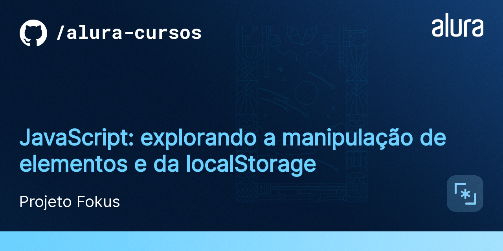

# Fokus

Olá, aventureiro(a) digital! Você acabou de embarcar na jornada de descoberta do nosso projeto incrível desenvolvido ao longo do curso "JavaScript: explorando a manipulação de elementos e da localStorage". Agarre-se à sua cadeira, pois vamos desbravar os mares do código!

## Uma pitada sobre o Projeto

O nosso querido projeto é uma aplicação web simples e interativa que permite aos usuários adicionar, editar, visualizar e remover tarefas, tudo em um ambiente visual agradável e amigável. Mas não se engane, apesar de sua simplicidade, ele é o campo de batalha onde você vai treinar e aprimorar suas habilidades em JavaScript e manipulação da DOM.

## As Magias que o Projeto Realiza

1. Adicionar Tarefas: Um botão mágico revela um formulário onde você pode escrever e adicionar novas tarefas.
2. Editar Tarefas: Clique em um botão editar e voilà, você pode alterar a descrição da tarefa.
3. Visualizar Tarefas: As tarefas adicionadas estão todas lá, bonitas e organizadas, esperando por sua atenção.
4. Marcar Tarefas como Completas: Quando uma tarefa é finalizada, ela muda de aparência. É a magia do CSS e JavaScript acontecendo!
5. Remover Tarefas: Seja seletivo e remova apenas as tarefas completas ou jogue tudo para o alto e comece de novo com uma lista de tarefas limpa.

## O Caldeirão de Técnicas e Tecnologias

Aqui é onde a mágica acontece! Mergulhamos profundamente nas águas de:

- Manipulação da DOM: Aprendemos a manipular a estrutura de nossa página com JavaScript, criando, removendo e alterando elementos HTML.
- Eventos JavaScript: Exploramos o poder dos eventos JavaScript para criar uma interface interativa e responsiva.
- LocalStorage: Ensaiamos a dança de armazenar e recuperar dados usando a LocalStorage, mantendo nossas tarefas seguras e acessíveis mesmo após o navegador ser fechado.

## Como Abrir e Rodar o Projeto: Um Mapa do Tesouro para Navegar no Código

Ahoy, marujo(a) do código! Está pronto(a) para içar as velas e navegar pelas águas do nosso projeto? Segure firme o leme, pois vamos guiar você através dos passos para configurar e executar o projeto em seu ambiente local. Não se preocupe, não há monstros marinhos à vista, apenas um oceano de aprendizado esperando por você!

### Abastecendo o Navio

Certifique-se de que você tem um navegador web moderno instalado. Recomendamos o uso do Google Chrome ou Mozilla Firefox.

#### Navegando até o Projeto

Abra a pasta onde o projeto foi baixado ou extraído.
Você encontrará um arquivo chamado index.html. Este é o nosso mapa do tesouro!

#### Içando as Velas

Dê um duplo clique no arquivo index.html. Voilà! O projeto será aberto em seu navegador padrão, e você será transportado(a) para as terras encantadas da nossa aplicação de gerenciamento de tarefas.

#### Explorando as Ilhas do Código

Abra a pasta do projeto em seu editor de código favorito. Recomendamos o uso do Visual Studio Code ou Sublime Text.

Você encontrará três arquivos principais que contêm o código que faz a magia acontecer:

- script-crud.js: Onde as funcionalidades de CRUD (Criar, Ler, Atualizar e Deletar) das tarefas são implementadas.
- script.js: Um script adicional que pode conter outras funcionalidades JavaScript do projeto.
- styles.css: Onde a beleza do projeto é criada, com todos os estilos CSS que fazem nossa aplicação brilhar.

#### Ajustando as Velas:

Sinta-se livre para explorar, modificar e experimentar o código. O mar é vasto e cheio de descobertas!

#### Mensagens na Garrafa:

Se você encontrar algum bug ou tiver sugestões de melhorias, não hesite em compartilhar seus feedbacks.

Agora com o mapa em mãos e as instruções seguras, você está pronto(a) para desbravar as águas do nosso projeto! 

Que os ventos do aprendizado soprem sempre a seu favor, e que você encontre tesouros de conhecimento em cada linha de código. Boa viagem, e até a próxima aventura!

# AluraFokus

